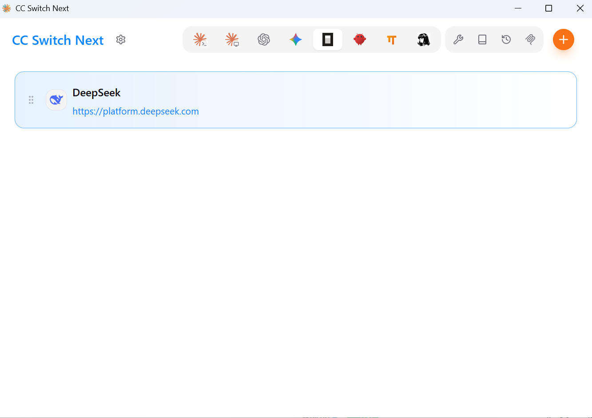
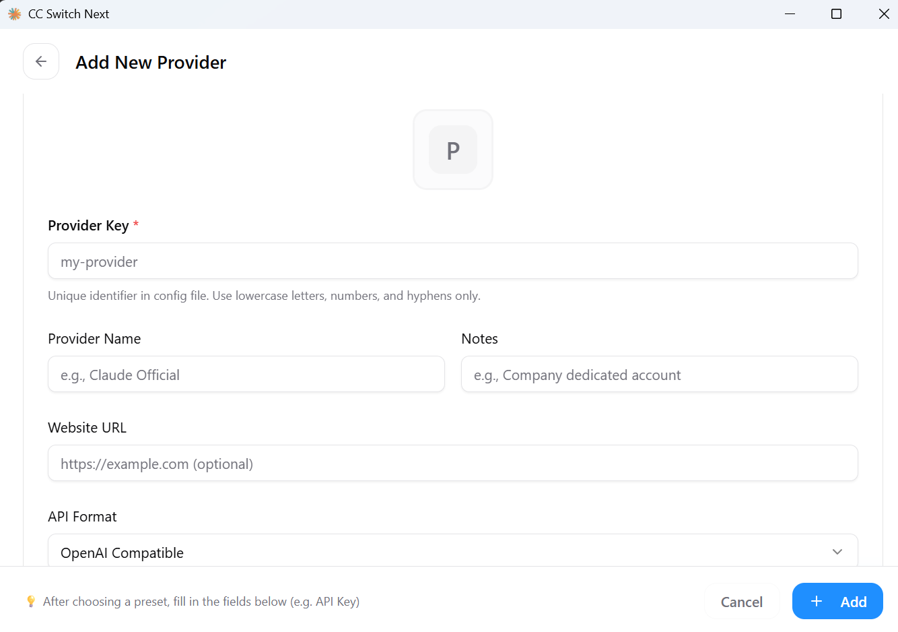

English | [中文](README_ZH.md)

## Why CC Switch Next?

CC Switch Next is a fork of [CC Switch](https://github.com/farion1231/cc-switch), a desktop GUI for managing AI coding tools. It gives you a visual interface to import and switch API providers, with 50+ built-in presets and unified MCP/Skills management.

### What's New in CC Switch Next

- **omp (Oh My Pi) Support** — Full integration with the omp coding agent, including provider management, MCP sync, and YAML-based config handling
- **Streamlined Provider List** — Removed obscure resellers; retained only well-known brands and platforms
- **Enhanced Multi-App Coverage** — 8 supported tools: Claude Code, Claude Desktop, Codex, Gemini CLI, OpenCode, OpenClaw, Hermes, and Oh My Pi

**Key features:**

- **Visual Provider Management** — 50+ presets across major AI platforms (Anthropic, OpenAI, Google, DeepSeek, Kimi, Zhipu, etc.); one-click switching
- **Unified MCP & Skills** — Single panel to manage MCP servers and Skills across supported tools with bidirectional sync
- **Proxy & Failover** — Local proxy with hot-switching, format conversion, auto-failover with circuit breaker
- **Session Manager** — Browse, search, and restore conversation history across supported session sources
- **System Tray Quick Switch** — Switch providers from the tray menu without opening the full app
- **Usage Tracking** — Spending, requests, and tokens with trend charts and per-model pricing
- **Windows Desktop App** — Native application for Windows, built with Tauri 2
- **Atomic Writes** — All config changes use temp file + rename to prevent corruption

## Screenshots

|                  Main Interface                   |                  Add Provider                  |
| :-----------------------------------------------: | :--------------------------------------------: |
|  |  |

## Features

### Provider Management

- **8 supported tools, 50+ presets** — Claude Code, Claude Desktop, Codex, Gemini CLI, OpenCode, OpenClaw, Hermes, omp
- **Universal providers** — One config syncs to Claude Code, Codex, and Gemini CLI
- One-click switching, system tray access, drag-and-drop sorting, import/export

### MCP, Prompts & Skills

- **Unified MCP panel** — Manage MCP servers across Claude, Codex, Gemini, OpenCode, Hermes, and omp with bidirectional sync
- **Prompts** — Markdown editor with cross-app sync (CLAUDE.md / AGENTS.md / GEMINI.md)
- **Skills** — One-click install from GitHub repos or ZIP files, custom repository management

### Usage & Cost Tracking

- Usage dashboard with trend charts, detailed request logs, and custom per-model pricing

### Session Manager & Workspace

- Browse, search, and restore conversation history across supported session sources
- **Workspace editor** (OpenClaw) — Edit agent files (AGENTS.md, SOUL.md, etc.)

### System & Platform

- **Cloud sync** — Custom config directory (Dropbox, OneDrive, iCloud, NAS) and WebDAV sync
- **Deep Link** (`ccswitch://`) — Import providers, MCP servers, prompts, and skills via URL
- Dark / Light / System theme, auto-launch, auto-updater, atomic writes, auto-backups, i18n (zh/zh-TW/en/ja)

## FAQ

<details>
<summary><strong>Which AI tools does CC Switch Next support?</strong></summary>

CC Switch Next supports eight tools: **Claude Code**, **Claude Desktop**, **Codex**, **Gemini CLI**, **OpenCode**, **OpenClaw**, **Hermes**, and **omp**. Each tool has dedicated provider presets and configuration management.

</details>

<details>
<summary><strong>Do I need to restart the terminal after switching providers?</strong></summary>

For most tools, yes — restart your terminal or the CLI tool for changes to take effect. The exception is **Claude Code**, which currently supports hot-switching of provider data without a restart.

</details>

<details>
<summary><strong>My plugin configuration disappeared after switching providers — what happened?</strong></summary>

CC Switch Next provides a "Shared Config Snippet" feature to pass common data (beyond API keys and endpoints) between providers. Go to "Edit Provider" → "Shared Config Panel" → click "Extract from Current Provider" to save all common data. When creating a new provider, check "Write Shared Config" (enabled by default) to include plugin data in the new provider. All your configuration items are preserved in the default provider imported when you first launched the app.

</details>

<details>
<summary><strong>Why can't I delete the currently active provider?</strong></summary>

CC Switch Next follows a "minimal intrusion" design principle — even if you uninstall the app, your CLI tools will continue to work normally. The system always keeps one active configuration, because deleting all configurations would make the corresponding CLI tool unusable. If you rarely use a specific CLI tool, you can hide it in Settings. To switch back to official login, see the next question.

</details>

<details>
<summary><strong>How do I switch back to official login?</strong></summary>

Add an official provider from the preset list. After switching to it, run the Log out / Log in flow, and then you can freely switch between the official provider and third-party providers. Codex supports switching between different official providers, making it easy to switch between multiple Plus or Team accounts.

</details>

<details>
<summary><strong>Where is my data stored?</strong></summary>

- **Database**: `~/.cc-switch/cc-switch.db` (SQLite — providers, MCP, prompts, skills)
- **Local settings**: `~/.cc-switch/settings.json` (device-level UI preferences)
- **Backups**: `~/.cc-switch/backups/` (auto-rotated, keeps 10 most recent)
- **Skills**: `~/.cc-switch/skills/` (symlinked to corresponding apps by default)
- **Skill Backups**: `~/.cc-switch/skill-backups/` (created automatically before uninstall, keeps 20 most recent)

</details>

## Quick Start

### Basic Usage

1. **Add Provider**: Click "Add Provider" → Choose a preset or create custom configuration
2. **Switch Provider**:
   - Main UI: Select provider → Click "Enable"
   - System Tray: Click provider name directly (instant effect)
3. **Takes Effect**: Restart your terminal or the corresponding CLI tool to apply changes (Claude Code does not require a restart)
4. **Back to Official**: Add an "Official Login" preset, restart the CLI tool, then follow its login/OAuth flow

### MCP, Prompts, Skills & Sessions

- **MCP**: Click the "MCP" button → Add servers via templates or custom config → Toggle per-app sync
- **Prompts**: Click "Prompts" → Create presets with Markdown editor → Activate to sync to live files
- **Skills**: Click "Skills" → Browse GitHub repos → One-click install to supported apps
- **Sessions**: Click "Sessions" → Browse, search, and restore conversation history across supported session sources

> **Note**: On first launch, you can manually import existing CLI tool configs as the default provider.

## Download

Download the latest Windows installer from the [Releases](https://github.com/benzhoupo/cc-switch-next/releases) page.

- `CC Switch Next_x.x.x_x64-setup.exe` (NSIS installer)
- `CC Switch Next_x.x.x_x64_en-US.msi` (MSI installer)

### System Requirements

- **Windows**: Windows 10 and above

<details>
<summary><strong>Architecture Overview</strong></summary>

### Design Principles

```
┌─────────────────────────────────────────────────────────────┐
│                    Frontend (React + TS)                    │
│  ┌─────────────┐  ┌──────────────┐  ┌──────────────────┐    │
│  │ Components  │  │    Hooks     │  │  TanStack Query  │    │
│  │   (UI)      │──│ (Bus. Logic) │──│   (Cache/Sync)   │    │
│  └─────────────┘  └──────────────┘  └──────────────────┘    │
└────────────────────────┬────────────────────────────────────┘
                         │ Tauri IPC
┌────────────────────────▼────────────────────────────────────┐
│                  Backend (Tauri + Rust)                     │
│  ┌─────────────┐  ┌──────────────┐  ┌──────────────────┐    │
│  │  Commands   │  │   Services   │  │  Models/Config   │    │
│  │ (API Layer) │──│ (Bus. Layer) │──│     (Data)       │    │
│  └─────────────┘  └──────────────┘  └──────────────────┘    │
└─────────────────────────────────────────────────────────────┘
```

**Core Design Patterns**

- **SSOT** (Single Source of Truth): All data stored in `~/.cc-switch/cc-switch.db` (SQLite)
- **Dual-layer Storage**: SQLite for syncable data, JSON for device-level settings
- **Dual-way Sync**: Write to live files on switch, backfill from live when editing active provider
- **Atomic Writes**: Temp file + rename pattern prevents config corruption
- **Concurrency Safe**: Mutex-protected database connection avoids race conditions
- **Layered Architecture**: Clear separation (Commands → Services → DAO → Database)

**Key Components**

- **ProviderService**: Provider CRUD, switching, backfill, sorting
- **McpService**: MCP server management, import/export, live file sync
- **ProxyService**: Local proxy mode with hot-switching and format conversion
- **SessionManager**: Conversation history browsing across supported session sources
- **ConfigService**: Config import/export, backup rotation
- **SpeedtestService**: API endpoint latency measurement

</details>

<details>
<summary><strong>Development Guide</strong></summary>

### Environment Requirements

- Node.js 18+
- pnpm 8+
- Rust 1.85+
- Tauri CLI 2.8+

### Development Commands

```bash
# Install dependencies
pnpm install

# Dev mode (hot reload)
pnpm dev

# Type check
pnpm typecheck

# Format code
pnpm format

# Check code format
pnpm format:check

# Run frontend unit tests
pnpm test:unit

# Run tests in watch mode (recommended for development)
pnpm test:unit:watch

# Build application
pnpm build

# Build debug version
pnpm tauri build --debug
```

### Rust Backend Development

```bash
cd src-tauri

# Format Rust code
cargo fmt

# Run clippy checks
cargo clippy

# Run backend tests
cargo test

# Run specific tests
cargo test test_name

# Run tests with test-hooks feature
cargo test --features test-hooks
```

### Testing Guide

**Frontend Testing**:

- Uses **vitest** as test framework
- Uses **MSW (Mock Service Worker)** to mock Tauri API calls
- Uses **@testing-library/react** for component testing

**Running Tests**:

```bash
# Run all tests
pnpm test:unit

# Watch mode (auto re-run)
pnpm test:unit:watch

# With coverage report
pnpm test:unit --coverage
```

### Tech Stack

**Frontend**: React 18 · TypeScript · Vite · TailwindCSS 3.4 · TanStack Query v5 · react-i18next · react-hook-form · zod · shadcn/ui · @dnd-kit

**Backend**: Tauri 2.8 · Rust · serde · tokio · thiserror · tauri-plugin-updater/process/dialog/store/log

**Testing**: vitest · MSW · @testing-library/react

</details>

<details>
<summary><strong>Project Structure</strong></summary>

```
├── src/                        # Frontend (React + TypeScript)
│   ├── components/
│   │   ├── providers/          # Provider management
│   │   ├── mcp/                # MCP panel
│   │   ├── prompts/            # Prompts management
│   │   ├── skills/             # Skills management
│   │   ├── sessions/           # Session Manager
│   │   ├── proxy/              # Proxy mode panel
│   │   ├── openclaw/           # OpenClaw config panels
│   │   ├── settings/           # Settings (Terminal/Backup/About)
│   │   ├── deeplink/           # Deep Link import
│   │   ├── env/                # Environment variable management
│   │   ├── universal/          # Cross-app configuration
│   │   ├── usage/              # Usage statistics
│   │   └── ui/                 # shadcn/ui component library
│   ├── hooks/                  # Custom hooks (business logic)
│   ├── lib/
│   │   ├── api/                # Tauri API wrapper (type-safe)
│   │   └── query/              # TanStack Query config
│   ├── locales/                # Translations (zh/zh-TW/en/ja)
│   ├── config/                 # Presets (providers/mcp)
│   └── types/                  # TypeScript definitions
├── src-tauri/                  # Backend (Rust)
│   └── src/
│       ├── commands/           # Tauri command layer (by domain)
│       ├── services/           # Business logic layer
│       ├── database/           # SQLite DAO layer
│       ├── proxy/              # Proxy module
│       ├── session_manager/    # Session management
│       ├── deeplink/           # Deep Link handling
│       └── mcp/                # MCP sync module
├── tests/                      # Frontend tests
└── assets/                     # Screenshots & partner resources
```

</details>

## Contributing

Issues and suggestions are welcome!

Before submitting PRs, please ensure:

- Pass type check: `pnpm typecheck`
- Pass format check: `pnpm format:check`
- Pass unit tests: `pnpm test:unit`

For new features, please open an issue for discussion before submitting a PR. PRs for features that are not a good fit for the project may be closed.

## License

MIT © benzhoupo

